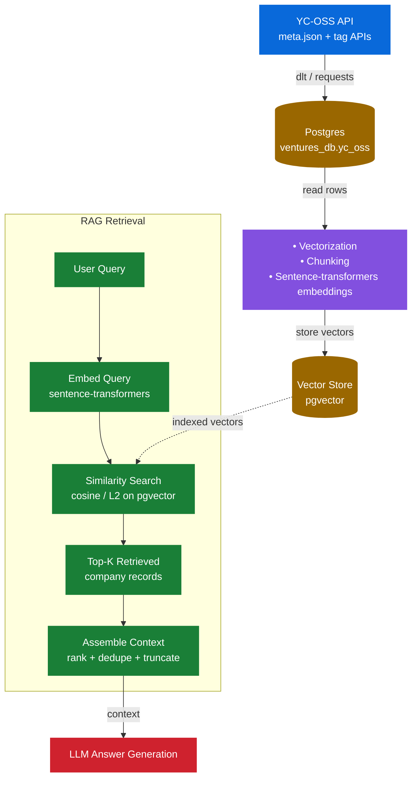
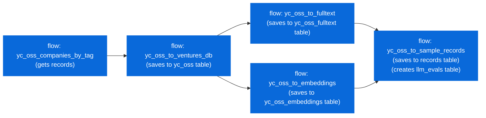
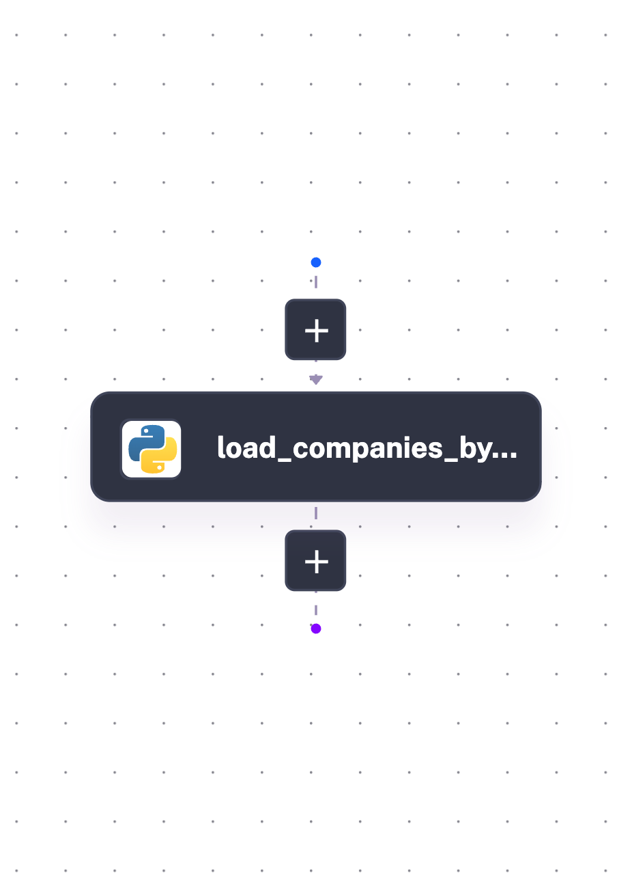
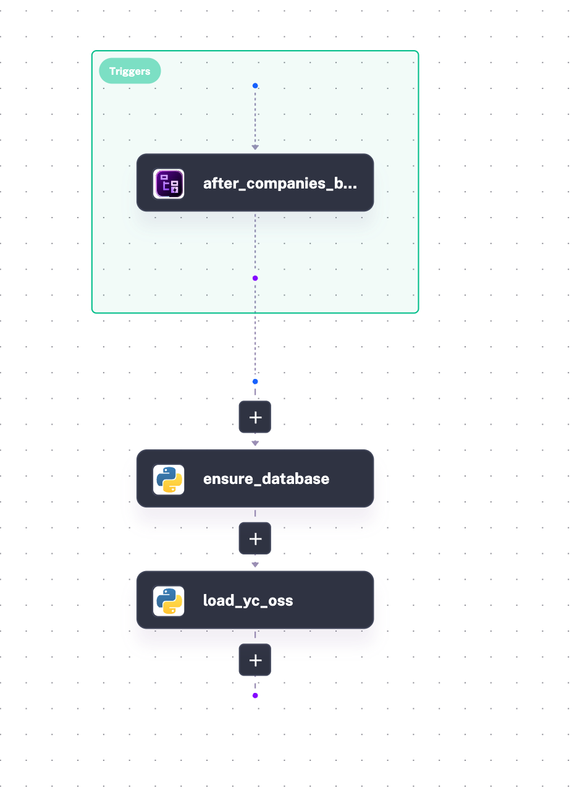
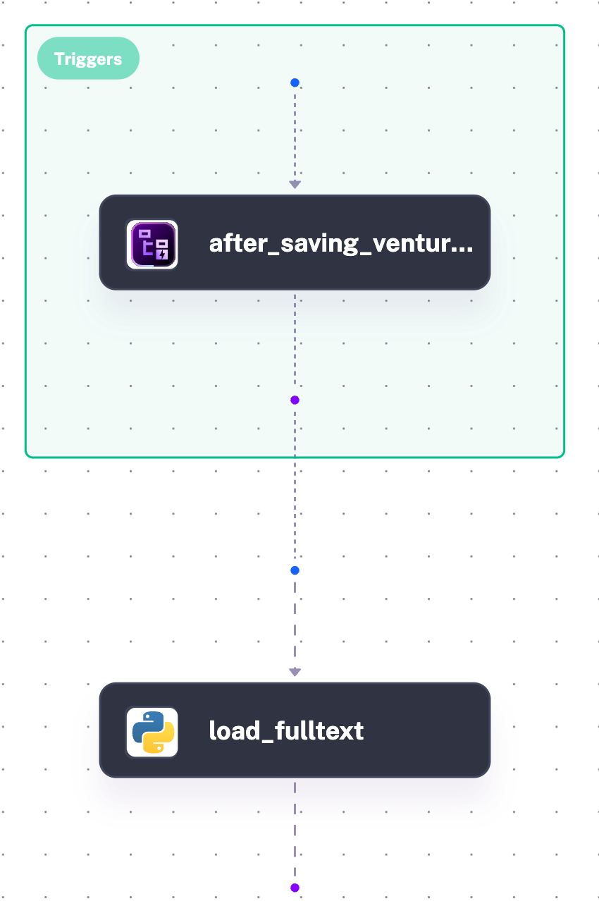
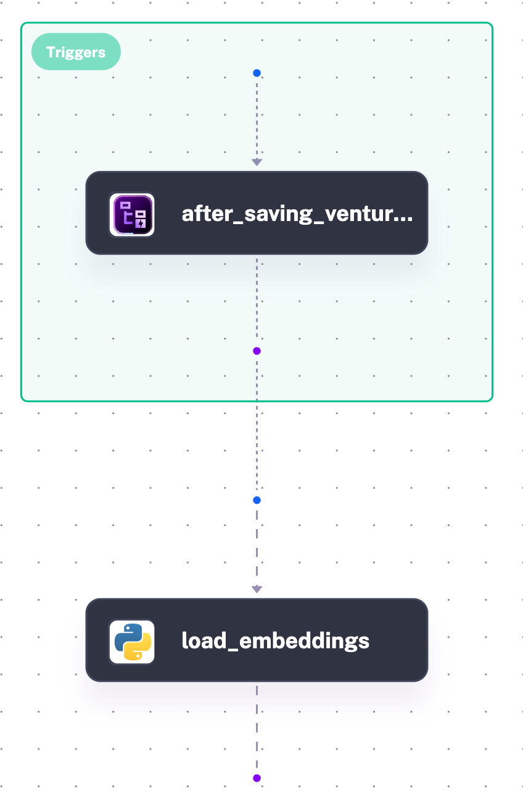
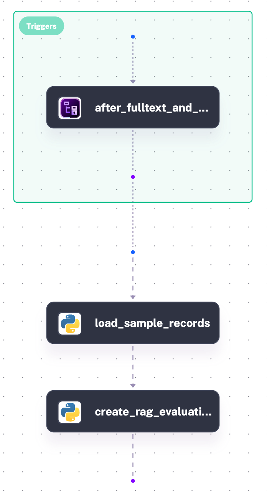
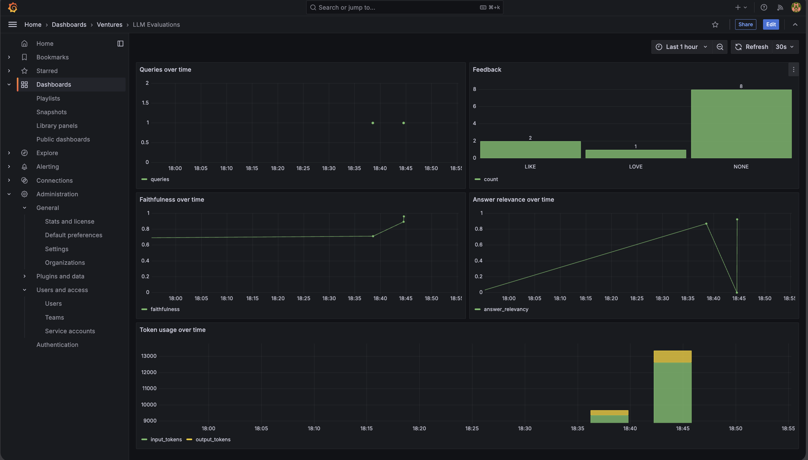

# Ventures AI
Ask about YC ventures

> Data Source: https://github.com/yc-oss/api (open sourec Y Combinator companies API) gleaned from [Y-Combinator Startup directory](https://www.ycombinator.com/companies)

### Table of Contents
- [Problem Statement](#problem-statement)
- [Concepts](#concepts)
- [Reproducibility](#reproducibility)
  - [Containerization](#containerization)
    - [Running the app](#running-the-app)
  - [Technologies](#technologies)
- [Retrieval Flow](#retrieval-flow)
- [Retrieval Evaluation](#retrieval-evaluation)
- [Ingestion Pipeline](#ingestion-pipeline)
- [LLM evaluation](#llm-evaluation)
- [Interface](#interface)
- [Monitoring](#monitoring)
- [Conclusion](#conclusion)
- [Acknowledgment](#acknowledgment)
- [AoB](#aob)

### Problem Statement
Let's find out about Companies in the Y-Combinator startup directory. Let's see which interesting startups (and ideas) there are.

<!-- - AI - langchain -->

### Concepts
The project showcases the following concepts from [LLM  Zoomcamp](https://github.com/DataTalksClub/llm-zoomcamp) 

- Chunking - Semantic chunking
- Hybrid search (Reciprocal Rank Fusion)
- Retrieval Evaluation
  - Relevance
  - Hit Rate
  - Cosine similarity index
  - ts rank (full text search)
- LLM Evaluation
  - Faithfulness
  - Relevance
  - Input/output tokens
  - User feedback
  <!-- - LLM-as-a-Judge -->

### Reproducibility

#### Containerization
Using <b>Docker</b>, The app comprises of several smaller apps, each scaffolded by docker into a single system. These serviecs are (as stated in the docker-compose yml):
- relational_db - postgres db
- chainlit - chat interface
- grafana - monitoring 

##### Running the app
- Run the docker compose file with the command below

<code>
  docker compose -p llm-capstone up -d
</code>

This starts up the app services, running below ports on localhost

| service | Port | Description |
|---------|------|-------------|
| Kestra | 8080 | Orchestrator, scaffolds db schema and loads data |
| Chainlit | 8000 | Chai interface |
| Grafana | 3000 | Monitoring (faithfulness, relevance, input/output tokens) |

- Start by running Kestra flow, starting with `yc_oss_companies_by_tag`, this will trigger other flows as described in the ingestion pipeline below

#### Technologies
- Container :- Docker
- Chat - Chainlit
- Orchestration :- Kestra, dlt, (use dbt to work an online data warehouse)
- DB :- Postgres, pgvector, tsvector
- Monitoring :- Pydantic Logfire
- Closed source and Open source LLM :- perf between Ollama (Mistral) and Opus (Claude)

### Retrieval Flow

### Retrieval Evaluation

Retrieval evaluation is described in-depth in the [ventures notebook](./notebooks/ventures.ipynb). We look at Hit-rate, MRR, Cosine similarity and full-text search ranking.

The notebook also investigates performance of closed (gpt-5.4-mini) vs open model (ollama). The chat interface uses gpt-5.4-mini as the default model.

The notebook covers generation of ground truths, and checking of Hit rate and MRR via the two different models. In the process of evaluation, we generate ground truths from the sample (1/10th) of the full dataset of ~5k records. Using this sample, five questions are generated per record for the ground truth

As summarised under _Hit Rate/MRR Interpretation_ below are the findings

> **gpt-5.4-mini on full knowledgebase**
> 
> Hit rates: Text search: 0.28291746641074855, Vector search: 0.3017274472168906
> 
> MRR: Text search: 0.21040307101727426, Vector search: 0.23048624440179147
>
> **gpt-5.4-mini on sample data**
> 
> Hit rates: Text search: 0.4798464491362764, Vector search: 0.5044145873320537
> 
> MRR: Text search: 0.375399872040948, Vector search: 0.4022840690978897

> **llama3.2 on full knowledgebase**
> 
> Hit rates: Text search: 0.2872727272727273, Vector search: 0.25333333333333335
> 
> MRR: Text search: 0.22344781144781126, Vector search: 0.1926734006734004
>
> **llama3.2 on sample data**
> 
> Hit rates: Text search: 0.41494949494949496, Vector search: 0.4072727272727273
> 
> MRR: Text search: 0.3442087542087545, Vector search: 0.3259461279461283

> 
> This results are as expected because of the reasons below:
>   - The ground truth questions are built from a subset of the database (1/10th) - hit-rate and mrr performance improves on checking the sampled dataset vs checking against the full dataset
>       - Testing on the main data includes other similar companies that answer the questions in the ground truth
>   - The results we're looking for are more generalized (top k matching) than, for example, specific company documents with specific information, where the results are required to be specific (top 1 matching)
>
> Model Performance
> 
> - gpt-5.4-mini model captures semantics better in generating ground truths compared with llama3.2 - observed by hit-rates/mrr differences between the two models; For llama3.2 - textsearch outperforms vector search

### Ingestion Pipeline
Tools: Kestra, DLT, Postgres

`yc_oss_to_sample_records` only fires once **both** `yc_oss_to_fulltext` and `yc_oss_to_embeddings` have succ
eeded (a multi-flow `preconditions` trigger), since it joins their outputs.

For retrieval, Kestra is used as the Orchestration tool, with flows for retrieval from the yc-oss endpoint into postgres. 

Kestra runs the flows below

| flow | topology |
|------|----------|
| [yc_oss_companies_by_tag](./app/kestra/flows/yc_oss_companies_by_tag.yaml) |  |
| [yc_oss_to_ventures_db](./app/kestra/flows/yc_oss_to_ventures_db.yaml) |  |
| [yc_oss_to_fulltext](./app/kestra/flows/yc_oss_to_fulltext.yaml) |  |
| [yc_oss_to_embedding](./app/kestra/flows/yc_oss_to_embeddings.yaml) |  |
| [yc_oss_to_sample_records](./app/kestra/flows/yc_oss_to_sample_records.yaml) |  |

<!--  -->
<!--  -->

> Note - that for the db flow, we can use [DBT](https://www.getdbt.com/) tool for scaffolding database schema - especially useful if having none trivial schemas 

### LLM evaluation
Using RAGAs to evaluate results, looking majorly into Faithfulness and Answer relevance - this guardrails for hallucinations and checking answer/context fit. We are also tracking input/output tokens and user feedback on each query

### Interface
Chatting interface exposed via **chainlit** at [localhost:8000](http://localhost:8000). **Chainlit** scaffolds the frontend user chat interface, having tight coupling with the backend. With this we don't need to scaffold a separate frontend and backend 

**Dashboard** - you can also view a simple static dasboard via chainlit; type /dashboard in the chainlit app chat interface

### Monitoring
Using Pydantic logfire, with the pydantic Agent wrapped call to pgvector rag.

Using Grafana to graph from the llm_evaluations table. We are graphing on queries over time, relevance, faithfulness, input/output tokens, user feedback; as per the pic below

### Conclusion
The app answers some questions on YCombinator startups, though working with limited context (limited to top 20 retrievals)

The next steps would be building full agentic system that queries the full knowledgebase, integrating this with a graph knowledgebase for tighter semantic search 

### Acknowledgment
This project was made possible thanks to:

DataTalks.Club for the excellent LLM course facilitated Alexey Grigorev and the course instructors
LLM community for support, discussions, and shared learning experiences

### AoB
Now that you're here, check out my other projects on my [profile](https://github.com/dakn2005), and give a follow ;-)

