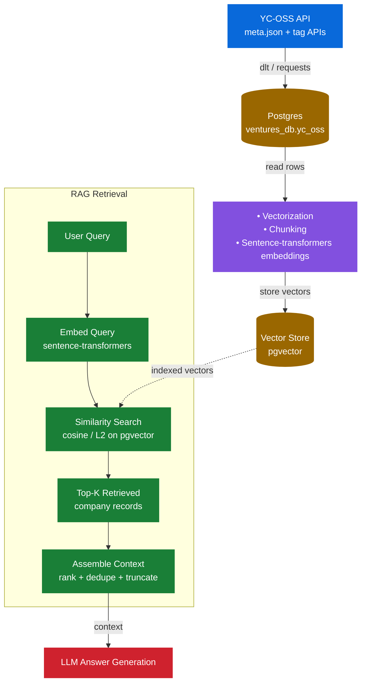
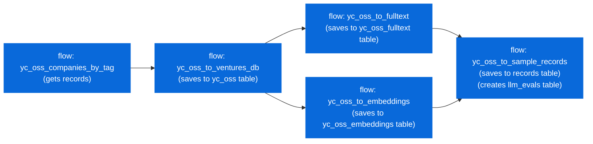

# Ventures AI
Ask about YC ventures

> Data Source: https://github.com/yc-oss/api (open sourec Y Combinator companies API) gleaned from [Y-Combinator Startup directory](https://www.ycombinator.com/companies)

### Problem Statement
Let's find out about Companies in the Y-Combinator startup directory

<!-- - AI - langchain -->

### Concepts
The project showcases the following concepts from [LLM  Zoomcamp](https://github.com/DataTalksClub/llm-zoomcamp) 

- Chunking - Semantic chunking
- Hybrid search
- RRF
  - Relevance
  - Hit Rate
- Evaluation
  - Cosine similarity index
  - Relevance
  - LLM-as-a-Judge

### Reproducibility

#### Containerization
Using <b>Docker</b>, The app comprises of several smaller apps, each scaffolded by docker into a single system. 

Run the docker compose file with the command below

<code>
  docker compose -p llm-capstone up -d
</code>

This starts up the app and exposes port 8000 for querying with the chatbot on the YC - Startups data 

#### Technologies
- Container :- Docker
- Backend :-Python, FastAPI
- Frontend :- React
- Chat - Chainlit
- Orchestration :- Kestra, dlt, (use dbt to work an online data warehouse)
- DB :- Postgres, pgvector
- Monitoring :- Pydantic Logfire
- Closed source and Open source LLM :- perf between Ollama (Mistral) and Opus (Claude)

### Retrieval Flow

### Ingestion Pipeline
Tools: Kestra, DLT, Postgres

`yc_oss_to_sample_records` only fires once **both** `yc_oss_to_fulltext` and `yc_oss_to_embeddings` have succ
eeded (a multi-flow `preconditions` trigger), since it joins their outputs.

For retrieval, Kestra is used as the Orchestration tool, with flows for retrieval from the yc-oss endpoint into postgres. 

Kestra runs the flows below

| flow | topology |
|------|----------|
| [yc_oss_companies_by_tag](./app/kestra/flows/yc_oss_companies_by_tag.yaml) |  |
| [yc_oss_to_ventures_db](./app/kestra/flows/yc_oss_to_ventures_db.yaml) |  |
| [yc_oss_to_fulltext](./app/kestra/flows/yc_oss_to_fulltext.yaml) |  |
| [yc_oss_to_embedding](./app/kestra/flows/yc_oss_to_embeddings.yaml) |  |
| [yc_oss_to_sample_records](./app/kestra/flows/yc_oss_to_sample_records.yaml) |  |

<!--  -->
<!--  -->

> Note - that for the db flow, we can use [DBT](https://www.getdbt.com/) tool for scaffolding database schema - especially useful if having none trivial schemas 

### LLM evaluation
Using RAGAs to evaluate results, looking majorly into Faithfulness and Answer relevance

### Interface
Chatting interface exposed via **chainlit**

**Dashboard** - to access the dasboard, type /dashboard in the chainlit app chat interface

### Monitoring
Using Pydantic logfire, with the pydantic Agent wrapped call to pgvector rag.
Using Grafana to graph from the llm_evaluations table

### Conclusion

### Acknowledgment
This project was made possible thanks to:

DataTalks.Club for the excellent LLM course facilitated Alexey Grigorev and the course instructors
LLM community for support, discussions, and shared learning experiences

### AoB
Now that you're here, check out other projects on my profile, and give a follow. :-) [profile](https://github.com/dakn2005)

